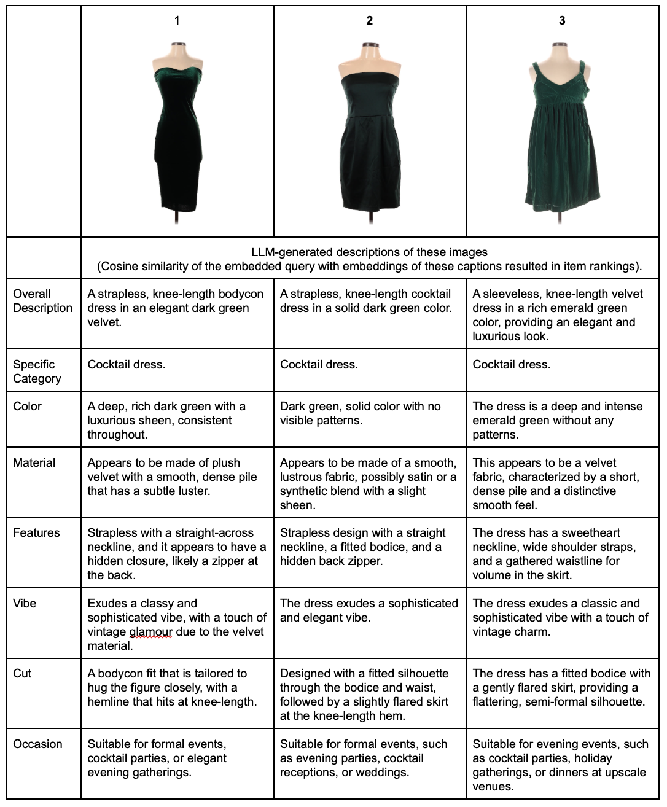
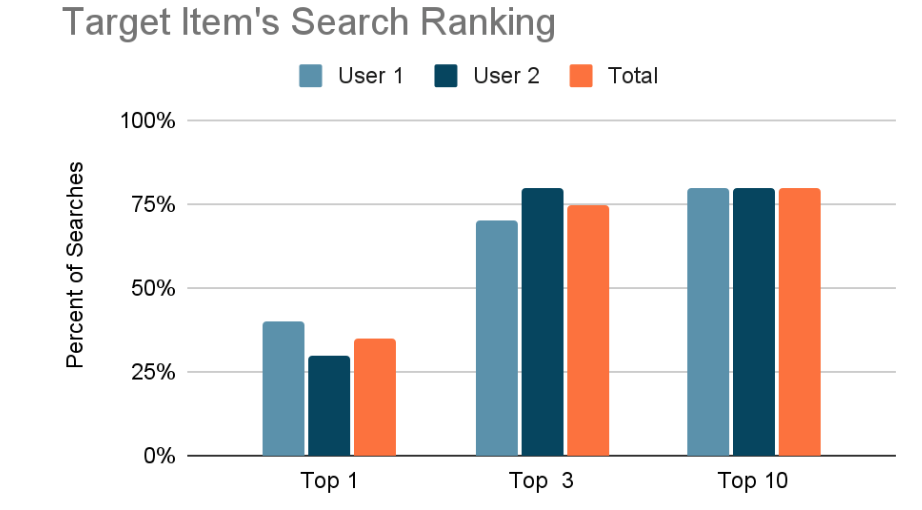
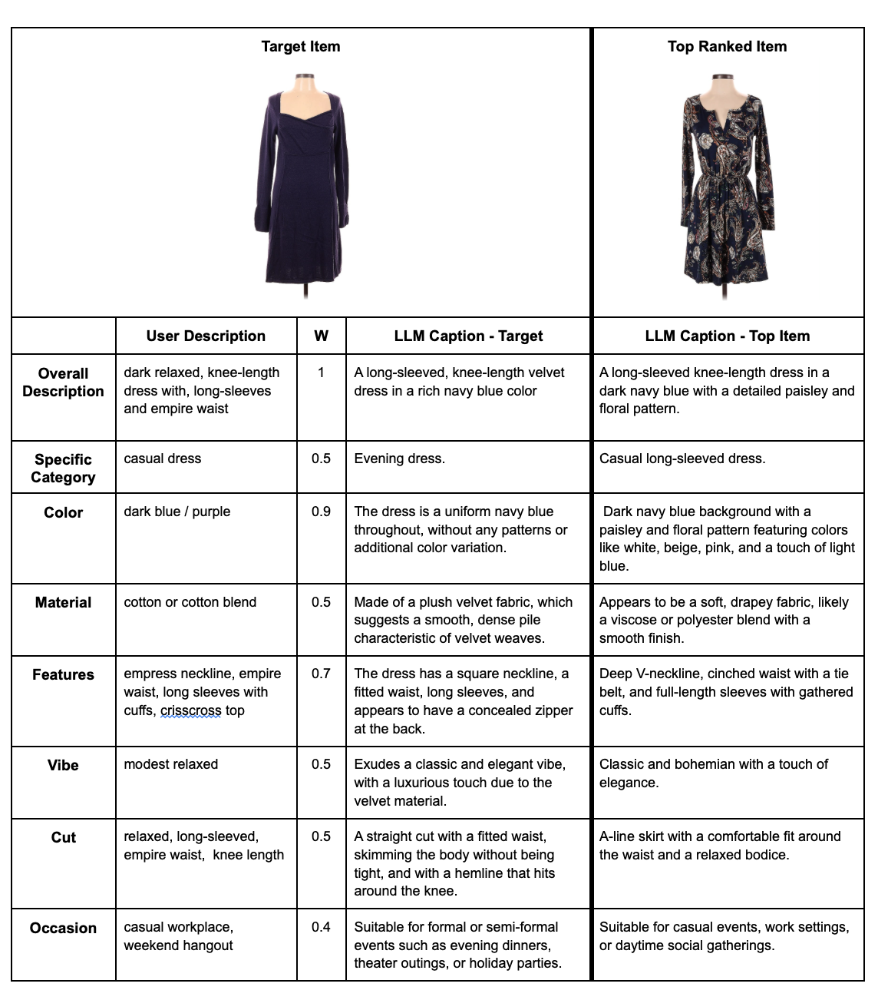

## OVERVIEW

Our AI-driven model promotes sustainable clothing choices by allowing users to find eco-friendly alternatives in thrifted clothing inventories using natural language searches. While online shopping offers access to vast warehouses of second-hand clothing, the difficulty in filtering through these inventories often puts it at a disadvantage compared to the curated collections of new clothing retailers.

We aim to overcome this by enabling users to go beyond traditional keyword-based searches for clothing. Using an LLM to label database images, users can query them based on nuanced semantic similarity. This results in a number of game-changing features:

1.   **No need for manual labeling of items.**  
e.g. A red and green plaid jacket with gold buttons, peter pan collar and slit pockets can be searched by its many features without needing them to be manually labeled.  

2.   **No need for word-for-word match between item description and query.**  
e.g. A search for baggy jeans will not fail to pull up an appropriate pair if they happen to have been labeled as wide-leg instead.  

3.   **Query words can be understood in context.**  
e.g. A “palm print jacket” and a “palm leather jacket” will not be misinterpreted as similar when “palm” in the first instance indicates a tropical print and in the second it refers to a vegan leather material.  

4.   **Items that are similar but not the same can be ranked accordingly.**  
e.g. A search for a strawberry print shirt will turn up a cherry print shirt as more similar than one with a flamingo print.

Building on the flexibility empowered by semantic search, we also allow users to contextualize the relative importance of the different elements of their search. For example, a user envisioning a pink silk cocktail dress to wear at a wedding can indicate that they care somewhat about color, marginally about material and most about the occasion for which it is suited.

## CODE

The project includes several key components:

- **Scrape Fashion Images:** Automates the collection of diverse fashion images from a secondhand online shop essential for training and testing our models across a variety of fashion items. (`A_fashion_image_scraper.ipynb`)

- **Caption Database of Images with OpenAI:** Utilizes OpenAI's API to generate accurate and descriptive captions for the fashion images, essential for creating a richly labeled dataset. (`B_image_captions_api_with_subcategories.ipynb`)  

- **Embed Database Captions for Search:** Employs OpenAI's embedding capabilities to transform image captions into vector representations, facilitating efficient similarity comparisons, a core functionality of our image search engine. (`C_database_embedding.ipynb`)  

- **Search Images:** Utilizes semantic understanding of search queries along with user-defined feature importance, to return the most relevant fashion items. (`D_user_query_embedding.ipynb`)  

- **Transition to in-house Visual Language Model (VLM):** A significant current focus is enhancing the project's cost-efficiency and independence by moving from using OpenAI to a locally trained Visual Language Model (VLM) for caption generation and embeddings. (`zB_fashion_image_captioner_VLM.ipynb`)

## RESULTS

To evaluate performance, we selected 20 images at random from a population of 200 dresses and had two users create search queries to find those items. We evaluated what percent of those searches successfully retrieved the desired item in the top 1, 3, or 10 query results.

Here is an example of a green velvet dress searched by one user. Based on their query text and weighting, it was returned as the top match out of the entire database. The second and third best matches are also dark green velvet dresses, demonstrating that the search returns not just the item of interest, but other similar items.

Out of 20 searches, 80% of the target items were retrieved in the top 10 results. This is well above the rate at which this would occur by chance (5%). Furthermore, results were similar across two users, suggesting that searchability is not highly dependent on a user’s ability to perfectly describe their item of interest.

We focused on how many items were returned in the top 10 because this corresponds to roughly the number of items that a user expects to encounter on a first page of search results. However, in general, our search algorithm appears to do substantially better than top-10, with only a small drop-off to 75% of items appearing in the top 3 search result items.

We were not entirely surprised that not nearly as many items appeared as the very top item in the search results (35%) because, as evident in the green velvet dress example above, user search queries would have to be extremely granular to differentiate between the most similar items in the inventory database.

## CHALLENGES

Of the 20 items searched, 4 were not returned anywhere in the top 10 items. Digging into the reasons for these mismatches, it was clear there were differences between the LLM description of the target image and the user’s description.

In some instances this was due to the LLM hallucinating features that were not accurate. For example, the dress below was labeled by the LLM as velvet, which it is not. It therefore became a less compatible match to the search query than the top ranked item, which was not mislabeled as velvet.

 In other instances the user struggled to label ambiguous features. In this example the assigned user labeled the dress as casual, but when randomly given to the other user they labeled it as formal, which would have been in agreement with the LLM’s assessment.

Finally, there were instances where the user used shorthand that may not have  been interpretable by the LLM. For example, in this case the user labeled the dress as blue/purple to indicate it was at the interface of these two colors, but the LLM didn’t appear to have a preference for a blended blue and purple rather than separately having both of these colors.

In future some of these challenges can be addressed. For example, color can be made more objective by allowing users to select from a color palette and labeling images based on their color distribution.Additionally, allowing users to provide examples of items they are searching for could give the search algorithm more detailed information to improve its matching accuracy.

## CONCLUSION

Our project shows substantial promise in improving the accessibility and appeal of sustainable and second-hand clothing options through advanced search capabilities.

